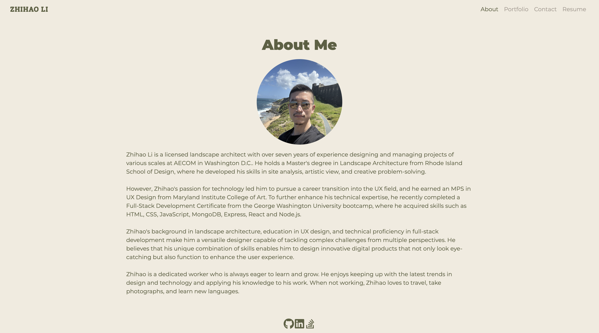
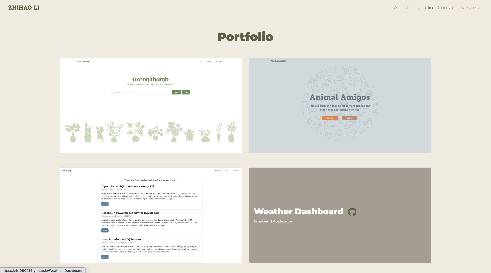
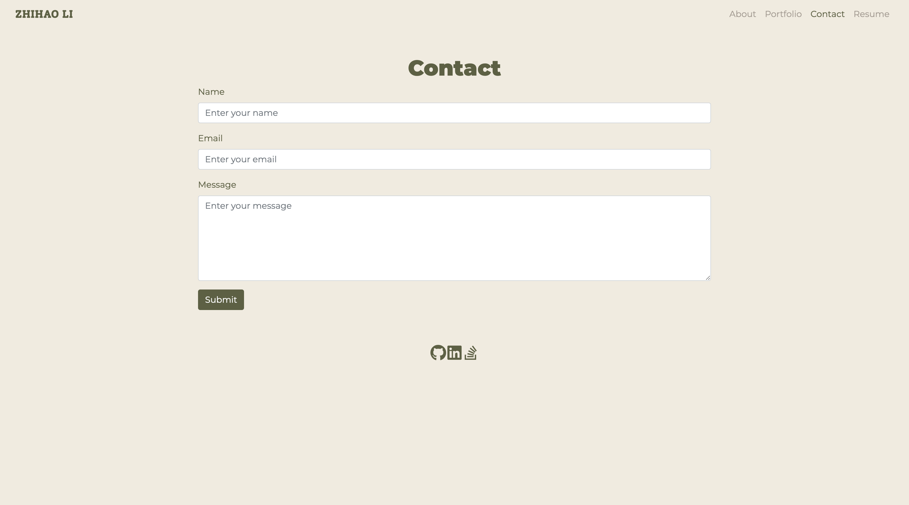
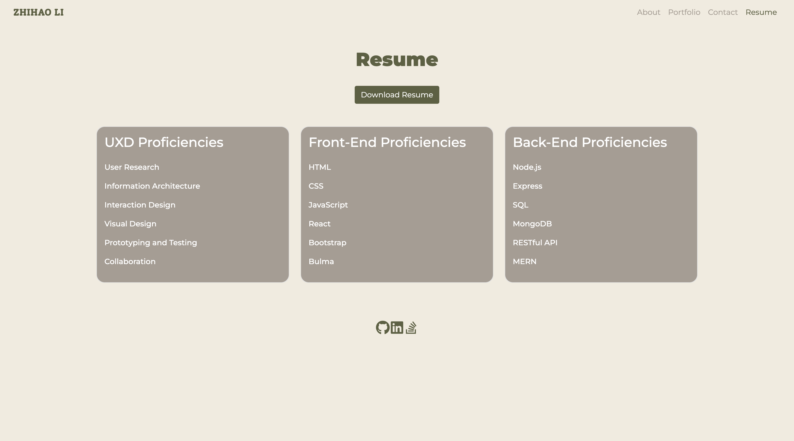

# React Portfolio

## Description
This project is a single-page application sharing my bio, portfolio, works, resume, and contact information for a future employer. The main technical skill used are React and Bootstrap. The application is a start point of my professional portfolio for job application and freelance works. It will keep improving with more projects and styles over time.

## Table of Contents
1. [Installation](#Installation)
2. [Usage](#Usage)
3. [Contributing](#Contributing)
4. [License](#License)
5. [Tests](#Tests)
6. [Questions](#Questions)
7. [Github](#Github)
8. [Deployed Application](#Deploy)
9. [Screenshots](#Screenshots)

## Installation 
1. Install package.json with command `npm i`

## Usage 
1. Open an external ternimal from the repository
2. Start the server with command: `npm start`
3. Deploy the app on GitHub with command `npm run deploy`

## Contributing 

### React
https://react.dev/

### Bootstrap 5.0
https://getbootstrap.com/

## License 
UNLICENSED

## Tests 
N/A

## Questions 

### Email
1. zli02@alumni.risd.edu
2. seanlee900214@gmail.com

## Github 

### Author profile
https://github.com/lzh1990214

### Github repository
https://github.com/lzh1990214/React-Portfolio

## Deployed Application 
https://lzh1990214.github.io/React-Portfolio

## Screenshots 

### About page

### Portfolio page

### Contact page

### Resume page

